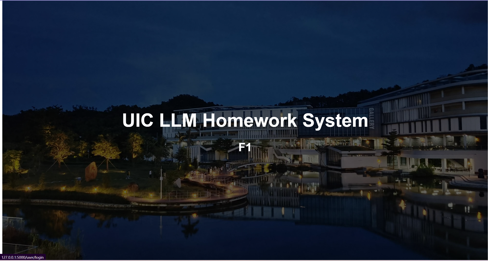
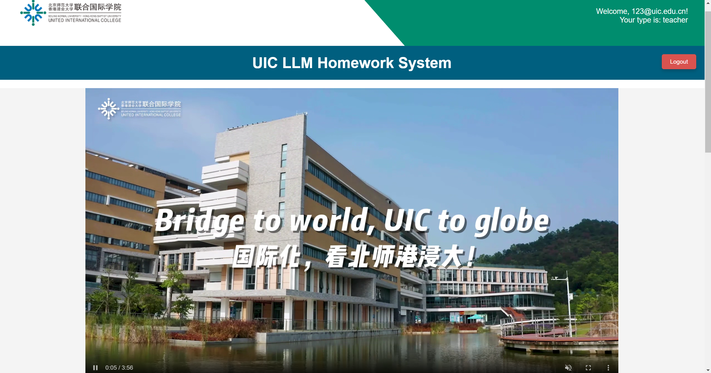

# 🚀 **A Properly Using LLMs in Homework Assignment Helper System** <!-- A Properly Using LLMs in Homework Assignment Helper System -->

> 🌟 **This is the BNU-HKBU United International College Software Enginnering/Software Development Workshop course project**

---


## 📖 **Introduction**
Recently Large Language Models (LLMs) such as ChatGPT by OpenAI have taken the world by storm.  Bill Gates said the ChatGPT demonstration he saw was, “the most stunning demo I’ve ever seen”.   Some education institutions such as New York City public schools  and UIC  banned, at least temporarily, the use of ChatGPT in the classroom, fearing students could do homework assignments using LLMs without learning the class material.

An app is needed to help teachers to create homework assignments that could not be easily done using LLMs without the students learning the class material.  This app is sorely needed because few teachers are aware of what LLMs could and could not do.  Furthermore, if used properly, LLMs can actually help students to learn the course material. 

We in the CST program are in better position than other programs in UIC to understanding the ability and limitation of LLMs.  So let’s build a website to help teachers and students to use LLMs properly and avoid their misuse.

As an open-source project, it also serves as a valuable reference for future students enrolled in SE or SDW courses.

---

## 🖼️ **Project Showcase**




---

## 🛠️ **Installation**
### 📥 **Download**
Please download the homepage video using the following link:  
[Download Video](https://drive.google.com/file/d/1eFBbLqNtMJAorYxUepGxbWP7NyaYu4fM/view?usp=sharing)

### 🔧 **Pre-request**
- 📦 **Request 1**：Ensure you have your VPN configured and running if required for accessing certain resources. Follow your VPN provider’s instructions for setup.
- 🖥️ **Request 2**: Python 3.x, pip (Python package installer), A web browser (Chrome is recommended for the best compatibility).
- ✨ **Request 3**: Ensure you have `XAMPP Control Panel` connect with your database.

### 📦 **Steps**
1. **Clone the repository**：
   ```bash
   git clone https://github.com/Eurekaarrow/UIC_LLMs_Helper.git
   ```
2. **Install dependencies**：
   ```bash
   cd your-repo
   pip install flask flask_sqlalchemy flask_mail
   ```

---

## 📊 **Usage**
```bash
# run the flask framework in terminal
python teamwork.py
```
_Or you can run the `teamwork.py` in the Pycharm or VSCode._

---

## 🤝 **Contribution**
🙌 Contributions to this project are welcome! You can participate in the following ways:
1. **Submit an Issue**：Report bugs or suggest new features.
2. **Submit a Pull Request**：Contribute improvements to the project code.

---

## 📝 **License**
This project is licensed under the [MIT License](LICENSE). Please make sure you understand its terms.

---

## 🏆 **Acknowledgement**
Thank you to everyone who has contributed to this project! Special thanks to all users and the open-source community! We are Group F1. 💖

---

## 📞 **Contact**
If you have any questions, please contact Yuchen Guo at r130026037@mail.uic.edu.cn or eurekaarrow@gmail.com. You can also visit Yuchen Guo's personal [Homepage](https://eurekaarrow.github.io) at eurekaarrow.github.io🌐.

---

## 📚 **Citation**
If you use this project in your research or work, please cite it as follows:

```plaintext
Guo, Yuchen. (Aug 2024). A Properly Using LLMs in Homework Assignment Helper System. Github. https://github.com/Eurekaarrow/UIC_LLMs_Helper
```

or

```plaintext
@inproceedings{guo2024properly,  
    author = {Yuchen Guo},  
    title = {A Properly Using LLMs in Homework Assignment Helper System},  
    booktitle = {UIC LLMs Helper},  
    year = {2024},
    month = {Aug}
    url = {https://github.com/Eurekaarrow/UIC_LLMs_Helper}  
}
```

